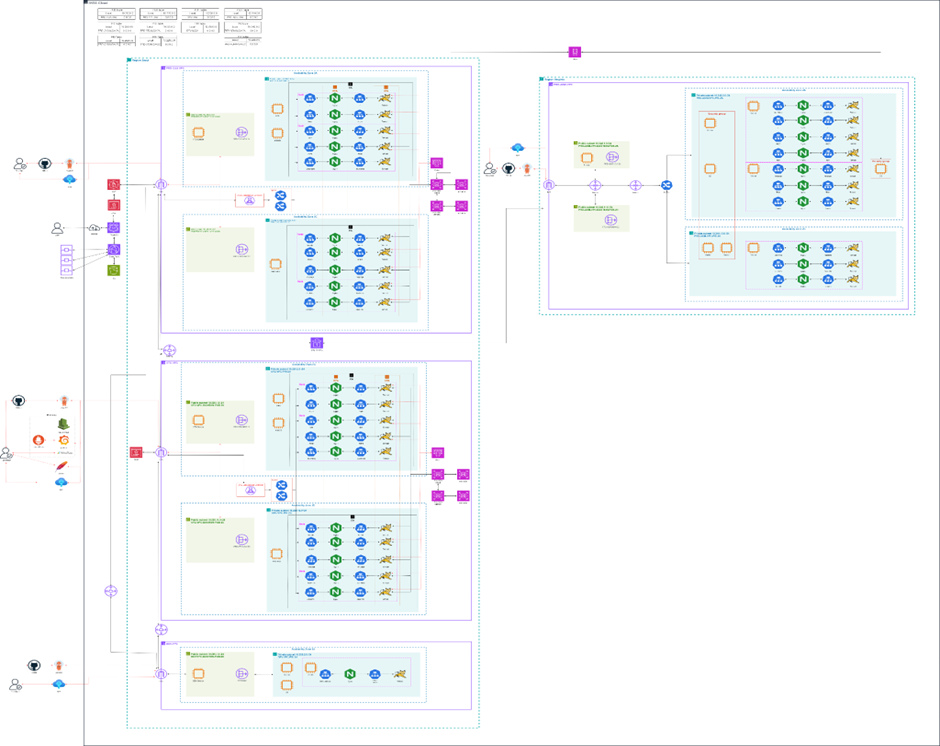

# 💻 Team Project
 

[Terraform을 활용한 AWS 인프라 구축 발표자료.pdf](https://github.com/user-attachments/files/17642989/Terraform.AWS.pdf)

 

📜 목차
---
1. 프로젝트 목적
2. 프로젝트 일정
3. 프로젝트 개요
4. 기술 스택
5. 산출물

 

🎨 프로젝트 목적
---
Terraform을 활용한 AWS Hybrid 환경 3-Tier 웹 서비스 구축
- Public Cloud(AWS)와 온프레미스 환경을 통합하여 효율적인 인프라 운영을 목표로 한 프로젝트입니다.
- Terraform을 사용해 인프라 자원을 코드로 관리하고, 배포와 유지보수 작업을 자동화했습니다.

 

📅 프로젝트 일정
---
- 일정: 2024년 9월 19일 ~ 10월 4일 (3주)

 

📍 프로젝트 개요
---
코로나19 이후 게임 유행이 가속화 되면서 사람들이 공유하고 이야기하는 게임들이 변화하여 다양한 장르의 게임을 제공하는 플랫폼을 구축하기 위해 기획하였습니다.
 

이 프로젝트의 목적은 다양한 장르의 게임을 쉽게 제공 받을 수 있도록 **플랫폼을 구축**하고 **예상치 못한 과부화로 인해 서비스가 중단되는 것을 방지**하는 것이었습니다.

 

📍 기술 스택
---

 
   
  
    
   

   
   
  
   
  
     

  
  
    
 

  
  

 

📍 산출물
---
#### 🌎 아키텍처

